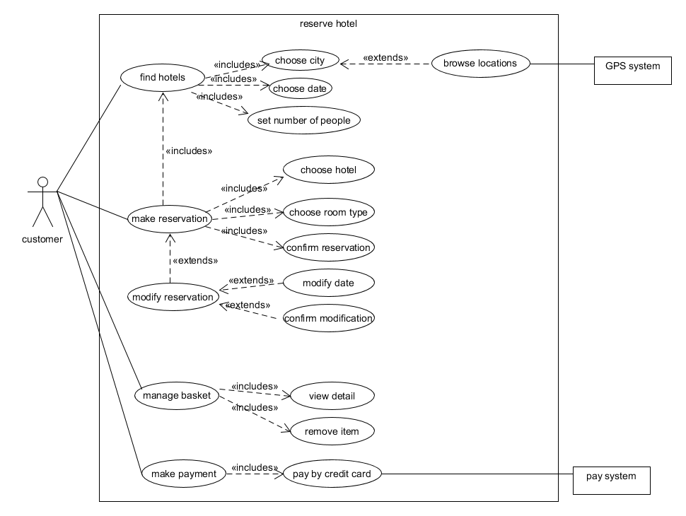
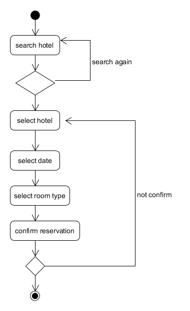
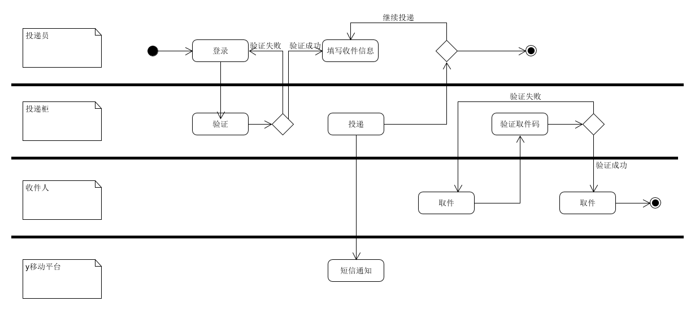
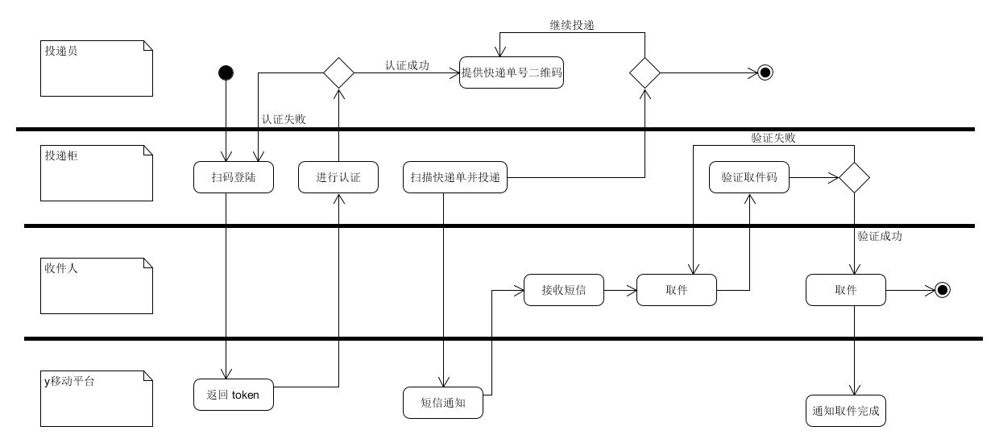
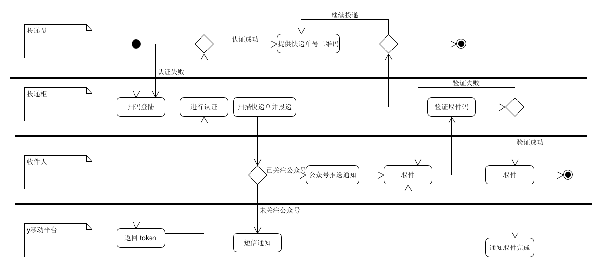

使用 **UMLet** 建模：

- 1、根据订旅馆建模文档，

  Asg-RH.pdf

  - 绘制用例图模型（到子用例）

    

  - 给出 make reservation 用例的活动图

    

- 2、根据课程练习“投递员使用投递箱给收件人快递包裹”的业务场景

  - 分别用多泳道图建模三个场景的业务过程

  场景一

  

  场景二

  

  场景三

  

  - 根据上述流程，给出快递柜系统最终的用例图模型
    - 用正常色彩表示第一个业务流程反映的用例
    - 用绿色背景表述第二个业务场景添加或修改的用例，以及支持 Actor
    - 用黄色背景表述第三个业务场景添加或修改的用例，以及支持 Actor

    

